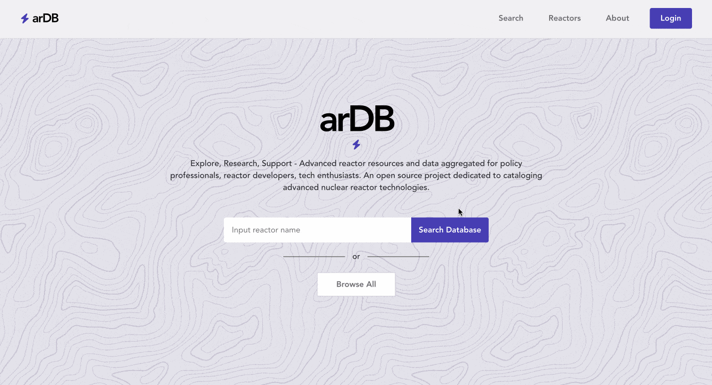

<div id="top"></div>

<!-- PROJECT LOGO -->
<br />
<div align="center">
  <!-- <a href="https://github.com/github_username/repo_name">
    
  </a> -->

<h3 align="center">Advanced Nuclear Reactors API (arDB) v2</h3>

  <p align="center">
    An API containing web scraped data of advanced nuclear reactor designs. 
    <br />
    <a href="https://github.com/danjkim21/adv-nuclear-reactor-api-v2"><strong>Explore the docs »</strong></a>
    <br />
    <br />
    <a href="https://ardb.vercel.app/">View Client Site</a>
    ·
    <a href="https://ardb.cyclic.app/api">View API Site</a>
  </p>
</div>

<!-- ABOUT THE PROJECT -->

## About The Project

<p align="center">
  
</p>

As an energy wonk, I've notice how difficult it is find up to date information on advanced nuclear reactor designs. This project aims to aggregate information on all advanced nuclear reactor technologies that exist around the world. <br>

This project is the second iteration of the arDB ([Version One Link](https://github.com/danjkim21/adv-nuclear-reactor-api)). This second iteration enhances the scraper to allow for multiple sources, and builds out the front end using <b>React.js. </b> It is a work in progress and the data is constantly evolving as I enhance my web scraper script and add new sources.

**The Client Side Repository and Live Link can be found here:**

- [https://github.com/danjkim21/adv-nuclear-reactor-client](https://github.com/danjkim21/adv-nuclear-reactor-client)
- [https://ardb.vercel.app/](https://ardb.vercel.app/)

### How It's Made

**Tech used:**

- [React](https://reactjs.org/)
- [Node.js](https://nodejs.org/en/)
- [Express](https://expressjs.com/)
- [Puppeteer](https://github.com/puppeteer/puppeteer)
- [Cheerio](https://cheerio.js.org/)
- [Lodash](https://lodash.com/)

The data for this API project was obtained by creating a custom web scraper script using Cheerio. At the moment, the scraper pulls data from the [International Atomic Energy Agency](https://aris.iaea.org/sites/overview.html) but the scraper will be enhanced to recieve multiple url inputs (if you have any quality sources, please let me know!).

<!-- GETTING STARTED -->

## Getting Started

This API can be accessed via [https://ardb.cyclic.app/api](https://ardb.cyclic.app/api) or as a local copy. To get a local copy up and running follow these simple example steps.

### Endpoints

1. Return full API database
   ```
   https://ardb.cyclic.app/api
   ```
2. Search API by Reactor Name
   ```
   https://ardb.cyclic.app/api/reactorName
   ```

### Installation

1. Clone the repo
   ```sh
   git clone https://github.com/github_username/repo_name.git
   ```
2. Install NPM packages
   ```sh
   npm install
   ```

<!-- USAGE EXAMPLES -->

### Usage

1. Run server
   ```sh
    npm run dev
   ```
2. Navigate to server
   ```sh
   `localhost:3000`
   ```

<!-- ROADMAP -->

## Roadmap

- [x] Finish building out the search reactor feature
- [x] Migrate json data to MongoDB
- [x] Interactive data table feature to sort reactors by specific item (eg. thermal output)
- [ ] Refactor pupeteer/cheerio scripts for automated insertion of data into MongoDB
- [ ] Feature to allow reactor developers to add reactor data
- [ ] Refactor front end react and back end code

See the [open issues](https://github.com/danjkim21/adv-nuclear-reactor-api-v2/issues) for a full list of proposed features (and known issues).

## Lessons Learned:

My biggest take away is how powerful JavaScript is as a language. Prior to this project, I assumed that I would always need Python to scrape any web content. After finding Cheerio, scraping content became--dare I say--a much less daunting experience due to how intuitive and easy to use Cheerio is.

<!-- CONTRIBUTING -->

## Contributing

If you have a suggestion that would make this better, please fork the repo and create a pull request. You can also simply open an issue with the tag "enhancement".

<!-- LICENSE -->

## License

Distributed under the MIT License. See `LICENSE.txt` for more information.

<!-- CONTACT -->

## Contact

Daniel Kim - [@devdanielk](https://twitter.com/devdanielk) - dan.jkim21@gmail.com

Project Link: [https://github.com/danjkim21/adv-nuclear-reactor-api-v2](https://github.com/danjkim21/adv-nuclear-reactor-api-v2)

Live Link: [https://ardb.vercel.app/](https://ardb.vercel.app/)

Project V1 Repo: [https://github.com/danjkim21/adv-nuclear-reactor-api](https://github.com/danjkim21/adv-nuclear-reactor-api)

<!-- ACKNOWLEDGMENTS -->

## Acknowledgments

- [IAEA ARIS Database](https://aris.iaea.org/sites/overview.html)
- [WIKI Source](https://en.wikipedia.org/wiki/List_of_small_modular_reactor_designs)

<p align="right">(<a href="#top">back to top</a>)</p>
